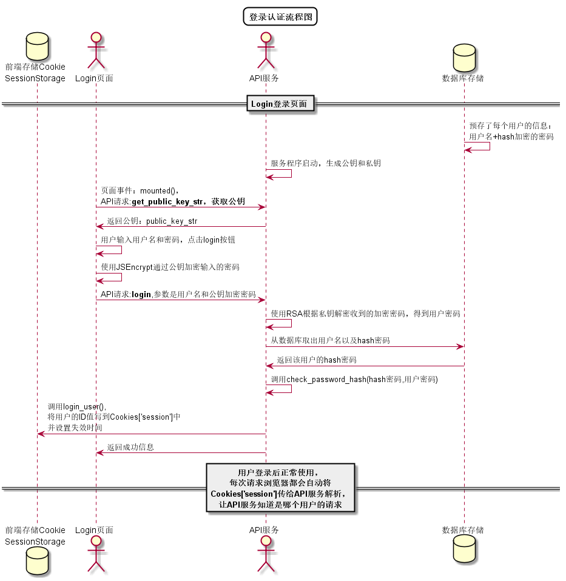

# “登录”用例 [返回](../README.md)

## 1. 用例规约

|用例名称|登录|
|-------|:-------------|
|功能|登录github平台|
|参与者|学生、教师|
|前置条件| |
|后置条件|登录成功后，跳转到用户的主页|
|主事件流| 1. 用户需要输入用户名和密码，选择用户类型（老师/学生） 2.系统判断用户名，密码，用户类正确，允许登录 3.系统在客户端以localstorage形式存储登录用户信息|
|备选事件流|1a. 输入的用户名或者密码为空  &nbsp;&nbsp; 1.提示重新输入   &nbsp;&nbsp; 2.访客重新提交登录信息  2a.系统判断用户名，密码，用户类不正确，不允许登录  &nbsp;&nbsp; 1.提示重新输入   &nbsp;&nbsp; 2.访客重新提交登录信息  3a.用户是否选择记住密码  &nbsp;&nbsp;1.选择是，则下次登录可以不用输入密码 &nbsp;&nbsp;2.反之则不会记住密码|

## 2. 业务流程
无

## 3. 界面设计
- 界面参照:https://crazyxfeng.github.io/is_analysis/test6/ui/登录.html
- API接口调用
    - 接口1：[login](../接口/login.md)

## 4. 算法描述 [源码](../src/登录认证流程图.puml)

    
## 5. 参照表

- [USERS](../数据库设计.md/#USERS)
